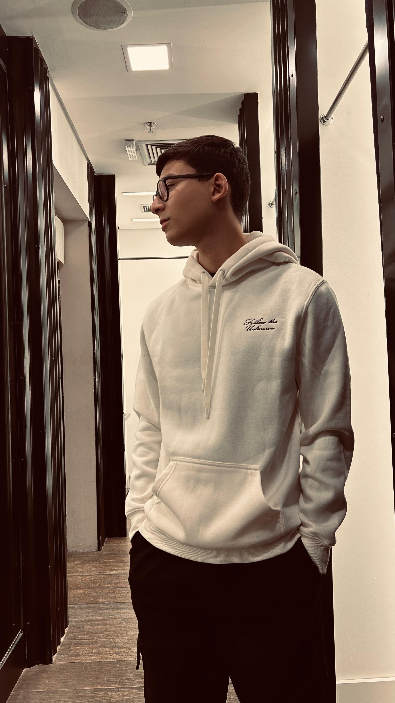

# 💼 Portfólio — Lucas Lima

<div align="center">



**Portfólio pessoal desenvolvido com HTML, CSS e JavaScript puro.**

[](https://lucasln7.github.io/Website-Portifolio/)
[](https://www.linkedin.com/in/lucas-lima-bb0043246/)
[](https://github.com/LucasLn7)

</div>

---

## 🌐 Demo ao Vivo

**👉 [lucasln7.github.io/lucas-portfolio](https://lucasln7.github.io/lucas-portfolio/)**

---

## 📸 Preview

> Site responsivo com animações, seções de experiência, skills, projetos e contato via WhatsApp.

---

## 🚀 Tecnologias Utilizadas

- **HTML5** — estrutura semântica
- **CSS3** — animações, gradientes, glassmorphism e layout responsivo
- **JavaScript** — interações, scroll reveal e integração com WhatsApp
- **Font Awesome 6** — ícones
- **Google Fonts** — tipografia (Syne + DM Sans)

---

## 📂 Estrutura do Projeto

```
portfolio/
├── index.html        # Estrutura principal
├── styles.css        # Estilos e animações
├── js.js             # Interações e lógica
├── curriculo.pdf     # Currículo em PDF
└── img/
    ├── imagem1.jpeg  # Foto de perfil
    └── imagem2.jpeg  # Imagem do projeto Corinthians
```

---

## ✨ Funcionalidades

- ✅ Navbar fixa com scroll suave e efeito blur
- ✅ Menu hambúrguer para mobile
- ✅ Botão de currículo com link direto
- ✅ Seção hero com anel animado e badge de disponibilidade
- ✅ Seção **Sobre** com cards informativos
- ✅ Seção **Experiência** em formato timeline
- ✅ Seção **Skills** com grid de tecnologias
- ✅ Seção **Projetos** com overlay interativo
- ✅ Seção **Currículo** com barras de progresso animadas
- ✅ Formulário de **Contato via WhatsApp**
- ✅ Footer com links sociais
- ✅ Animações de reveal ao scrollar
- ✅ 100% responsivo (mobile, tablet e desktop)

---

## 🛠️ Como Rodar Localmente

```bash
# Clone o repositório
git clone https://github.com/LucasLn7/portfolio.git

# Entre na pasta
cd portfolio

# Abra o arquivo no navegador
# (basta abrir o index.html diretamente ou usar Live Server no VS Code)
```

> Não precisa de instalação ou dependências. É HTML/CSS/JS puro!

---

## 📬 Contato

Tem alguma proposta ou quer trocar uma ideia?

- 💼 [LinkedIn](https://www.linkedin.com/in/lucas-lima-bb0043246/)
- 🐙 [GitHub](https://github.com/LucasLn7)
- 💬 WhatsApp — disponível pelo formulário no site

---

<div align="center">

Feito por **Lucas Lima** · 2026

</div>
